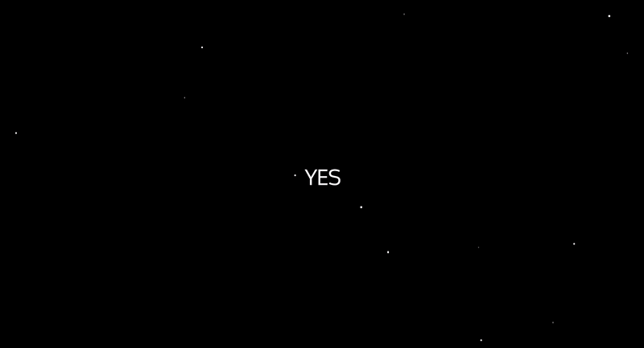

## READ ME
While I don't think about astrology often, **Mercury in Retrograde** asks the question, _'Is Mercury in Retrograde?'_  <br>
You can now see the profound answer of **yes** or **no** displayed amongst the stars in your browser. <br><br>
At the time of creating this, Mercury was, in fact, in retrograde:


Built with:
```
- Python
- Jinja
- HTTP Server
- JavaScript
- HTML
- CSS
- Mercury Retrograde API
```

To run:
```
- Open app.py and run
- Open browser to localhost:3000
```
